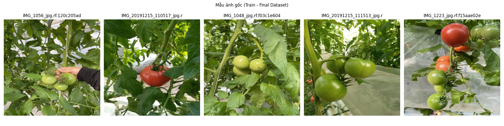
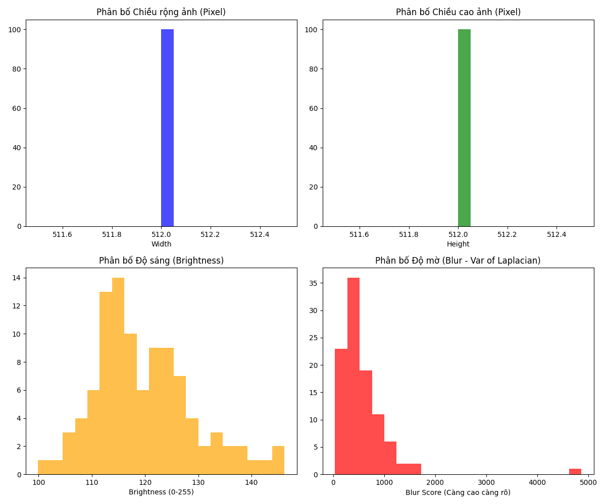
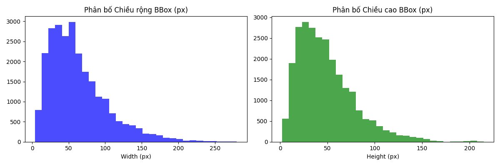
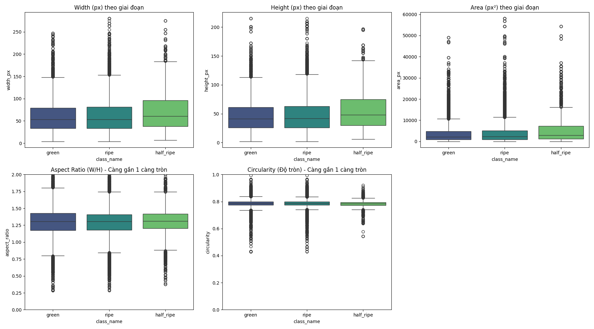
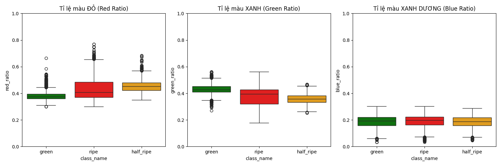
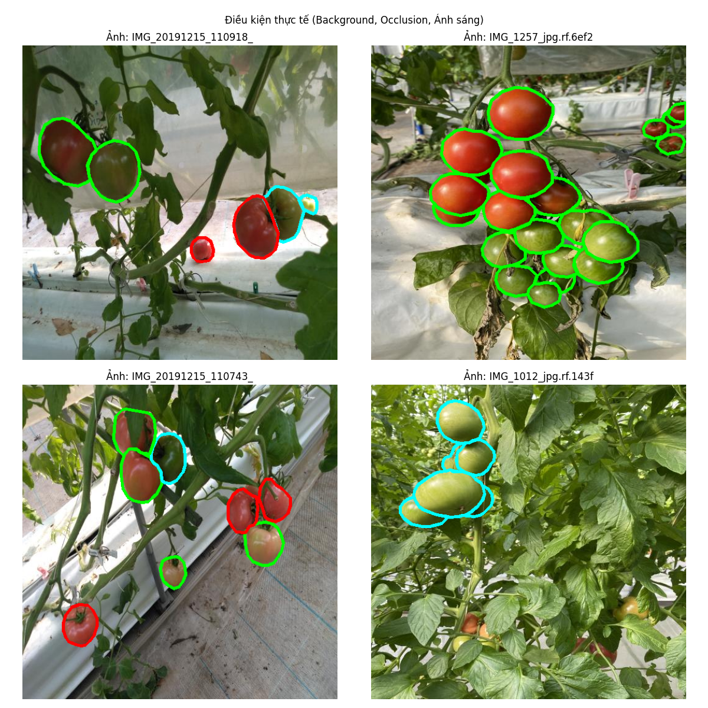

# BÁO CÁO EDA - DATASET CUỐI CÙNG (Đã chuẩn hóa ID)

**Ngày tạo:** 2026-08-19 21:44:06

## 1. TỔNG QUAN DATASET

- **Tổng số ảnh gốc (Detection):** 2492
  - **train:** 1744 ảnh
  - **valid:** 500 ảnh
  - **test:** 248 ảnh
- **Tổng số quả cà chua được annotate:** 25374

### Phân bố theo giai đoạn chín (Đã chuẩn hóa 3,4,5 về 0,1,2):
- **ripe (ID 0):** 12288 quả (48.4%)
- **green (ID 1):** 10158 quả (40.0%)
- **half_ripe (ID 2):** 2928 quả (11.5%)

## 2. MẪU ẢNH GỐC

## 3. CHẤT LƯỢNG ẢNH

## 4. THỐNG KÊ BOUNDING BOX

- **Trung bình số quả/ảnh:** 10.18 quả
- **Max số quả/ảnh:** 126 quả

## 5. PHÂN TÍCH KÍCH THƯỚC & HÌNH DÁNG

## 6. PHÂN TÍCH MÀU SẮC (Quan trọng)

Biểu đồ cho thấy sự tách biệt rõ rệt về tỉ lệ màu đỏ/xanh giữa 3 giai đoạn chín:

## 7. ĐIỀU KIỆN THỰC TẾ (Visual Check)

4 ảnh mẫu dưới đây hiển thị các Polygon khớp chính xác với từng quả:

## 8. KẾT LUẬN EDA

- **Dataset cuối cùng** bao gồm cả quả `big` và `little`, đã chuẩn hóa thành công về 3 class 0,1,2.
- **Phân bố class**: Quả `ripe` chiếm 43.5%, `green` 21.9%, `half_ripe` 7.5% (Không còn ID lạ).
- **Màu sắc**: Biểu đồ Red Ratio cho thấy sự tách biệt rõ rệt giữa các giai đoạn.
- **Kích thước & Hình dáng**: Kích thước quả đồng đều, quyết định thu hoạch dựa vào Màu sắc và Hình dáng.

---

*Báo cáo EDA được tạo tự động bởi script `eda_final.py`*